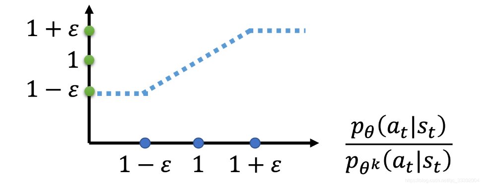
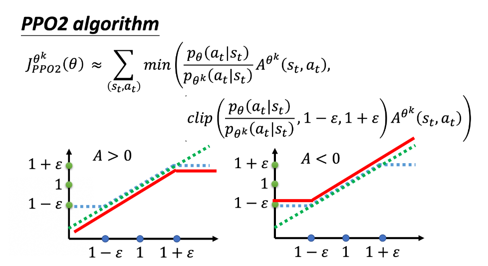

# PPO Algorithm
## 1. From On-policy to Off-policy
如果被训练的agent和与环境做互动的agent（生成训练样本）是同一个的话，那么叫做on-policy(同策略)。
如果被训练的agent和与环境做互动的agent（生成训练样本）不是同一个的话，那么叫做off-policy(异策略)。

## 2. Importance Sampling（重要性采样）
为什么要使用重要性采样呢？其实从PG算法的梯度公式可以看出来：
$$
\nabla\bar{R}(\tau)_{\tau \sim \pi_{\theta}} = [A^\theta(s_t,a_t)\nabla \log p_{\theta}(a^n_t | s_t^n)]
$$
可以观察到，在PG算法的梯度公式中，问题在于上面的式子是基于$\tau \sim \pi_{\theta}$来进行采样的，然而我们一旦更新了参数，使得$\theta$变成了$\theta^{'}$，梯度公式中的这个式子$\log \pi_{\theta}(a_t | s_t)$就不对了，因为此时如果还是用原先的策略产生的数据，将会导致参数更新错误。而重要性采样正式解决这样的问题，即使得我们可以从$\tau \sim \pi_{\theta}$所采样得到的分布，来计算更新后的$\theta^{'}$的问题。
### 2.1 Principle of Importance Sampling(重要性采样推导)
在数学形式化表示中，重要性采样的估计过程可以明确地表示为以下形式：

设 $p(x)$ 是目标分布，$q(x)$ 是重要性分布，且 $q(x) > 0$ 当且仅当 $p(x) > 0$（保证权重项存在且有限）。我们的目标是估计 $E_{p(x)}[f(x)]$，即：

$$ E_{p(x)}[f(x)] = \int f(x) p(x) \, dx $$

利用重要性采样，我们可以将上述积分重写为：

$$ E_{p(x)}[f(x)] = \int f(x) \frac{p(x)}{q(x)} q(x) \, dx = E_{q(x)}[f(x)\frac{p(x)}{q(x)}] $$

接下来，我们应用蒙特卡洛方法，从 $q(x)$ 中抽取 $N$ 个独立同分布的样本 $\{x_1, x_2, \ldots, x_N\}$，并使用这些样本来近似积分：

$$ E_{p(x)}[f(x)] \approx \frac{1}{N} \sum_{i=1}^{N} f(x_i) \frac{p(x_i)}{q(x_i)} $$

这里，$\frac{1}{N}$ 是样本的归一化因子，确保估计值在 $N \to \infty$ 时收敛到真实期望值。每个样本 $x_i$ 通过其对应的权重 $\frac{p(x_i)}{q(x_i)}$ 对总和做出贡献。

数学上，我们可以将上述估计记作：

$$ \hat{E}_{p(x)}[f(x)] = \frac{1}{N} \sum_{i=1}^{N} w_i f(x_i) $$

其中，$w_i = \frac{p(x_i)}{q(x_i)}$ 是第 $i$ 个样本的权重。

注意，重要性采样的效率很大程度上取决于 $q(x)$ 的选择。理想情况下，$q(x)$ 应该与目标函数 $f(x)$ 和目标分布 $p(x)$ 的乘积 $|f(x)|p(x)$ 成正比，但这通常很难实现。因此，在实际应用中，我们通常会根据问题的具体特点来选择或设计 $q(x)$。

### 2.2 Importance Sampling applied to the PG algorithm
正和上面推导的一样，将式子 $$ E_{p(x)}[f(x)] = E_{q(x)}[f(x)\frac{p(x)}{q(x)}] $$ 应用在PG算法的的梯度公式当中，得到了 
$$ 
\nabla\bar{R}(\tau)_{\tau \sim \pi_{\theta^{'}}} = [\frac{p_\theta(a_t,s_t)}{p_{\theta^{'}}(a_t,s_t)} A^{\theta^{'}}(s_t,a_t)\nabla \log p_{\theta}(a^n_t | s_t^n)]
$$
将上面的式子中的 $p_\theta(a_t,s_t)$ 以及 $p_{\theta^{'}}(a_t,s_t)$展开，得到俩最终的梯度公式：
$$
\nabla\bar{R}(\tau)_{\tau \sim \pi_{\theta^{'}}} = [\frac{p_\theta(a_t|s_t)}{p_{\theta^{'}}(a_t|s_t)} \frac{p_\theta(s_t)}{p_{\theta^{'}}(s_t)} A^{\theta^{'}}(s_t,a_t)\nabla \log p_{\theta}(a^n_t | s_t^n)]
$$
此外，在实际过程中，我们认为某一个状态$s_t$出现的概率与策略函数无关，只与环境有关，所以可以认为$p_{\theta}(s_t) \approx  p_{\theta^{'}}(s_t)$，由此得出如下的公式：
$$
\nabla\bar{R}(\tau)_{\tau \sim \pi_{\theta^{'}}} = [\frac{p_\theta(a_t|s_t)}{p_{\theta^{'}}(a_t|s_t)} A^{\theta^{'}}(s_t,a_t)\nabla \log p_{\theta}(a^n_t | s_t^n)]
$$
所以依据上面的推测，我们可以反推出目标函数为：
$$
J^{\theta^{'}}(\theta) = \mathbb{E}_{(s_t,a_t) \sim \pi_{\theta^{'}}}[\frac{p_\theta(a_t|s_t)}{p_{\theta^{'}}(a_t|s_t)} A^{\theta^{'}}(s_t,a_t)]
$$

## 3. TRPO & PPO
### 3.1 TRPO
TRPO是PPO的前身，叫做信任区域策略优化(Trust Region Policy Optimization)。其思路如下：优化目标就是我们上面推出的$J^{\theta^{'}}(\theta)$是我们使用了重要性采样，而重要性采样的要求就是原采样和目标采样不能相差太大，这里就是说策略$\pi_\theta$和$\pi_{\theta^{'}}$的输出动作概率不能相差太大，TRPO采用KL散度(KL divergence)的方法来评价二者的差异，记作 $ KL(\theta,\theta^{'})$ 。TRPO规定，当进行优化时，$ KL(\theta,\theta^{'})$一定要小于某个阈值，即：
$$
J^{\theta^{'}}(\theta) = \mathbb{E}_{(s_t,a_t) \sim \pi_{\theta^{'}}}[\frac{p_\theta(a_t|s_t)}{p_{\theta^{'}}(a_t|s_t)} A^{\theta^{'}}(s_t,a_t)]\quad, \quad  KL(\theta,\theta^{'}) < \gamma

$$

### 3.2 PPO1
TRPO相当于给目标函数增加了一项额外的约束（constrain），而且这个约束并没有体现在目标函数里，在计算过程中这样的约束是很难处理的。PPO的做法就是将这样约束融进了目标函数，其目标函数如下：
$$
J^{\theta^{'}}(\theta) = \mathbb{E}_{(s_t,a_t) \sim \pi_{\theta^{'}}}[\frac{p_\theta(a_t|s_t)}{p_{\theta^{'}}(a_t|s_t)} A^{\theta^{'}}(s_t,a_t)] - \beta KL(\theta,\theta^{'})
$$

### 3.2.1 PPO算法流程  
#### 初始化  
- 初始化策略网络 $\pi_{\theta}$ 和价值网络 $V_{\phi}$ 的参数 $\theta$ 和 $\phi$  
- 初始化回放缓冲区 $D$  
  
#### 循环训练多个轮次  
对于每个轮次 $k = 0, 1, 2, ...$ 执行以下步骤：  
  
1. **数据收集**  
   - 在环境中运行当前策略 $\pi_{\theta_k}$，执行 $T$ 个时间步  
   - 记录每一步的轨迹（状态 $s_t$，动作 $a_t$，奖励 $r_t$，下一个状态 $s_{t+1}$）  
   - 将轨迹数据存入回放缓冲区 $D$  
  
2. **更新**  
   - 对 $N$ 个epoch，执行以下步骤：  
     - 从 $D$ 中随机采样一批数据  
     - 对于这批数据中的每个状态 $s_t$：  
       - 使用当前策略 $\pi_{\theta_k}$ 计算 $a_t$（以及可选地，动作分布中的熵 $H(t)$）  
       - 计算旧动作对应的旧策略下的概率 $\pi_{\theta_{old}}(a_t|s_t)$  
       - 计算优势估计 $\hat{A}_t$ 和价值估计 $\hat{V}_t$  
       - 计算损失函数 $L_{surr}(\theta)$, $L_{vf}(\phi)$, $L_{ent}(\theta)$  
       - 更新 $\theta$ 和 $\phi$ 以最小化总损失 $L_{total} = L_{surr}(\theta) - c_1 L_{vf}(\phi) + c_2 S[\pi_{\theta}](s_t) + ...$（其中 $S$ 是熵正则化项）  
       - 更新 $\theta_{old} \leftarrow \theta$ 

## 3.3 PPO2
PPO2也叫做PPO-Clip，该方法不采用KL散度作为约束，而是采用逻辑上合理的思路设计目标函数，其目标函数如下：
$$
J^{\theta^{'}}(\theta) = \sum_{(s_t,a_t)} \min( \frac{p_\theta(a_t|s_t)}{p_{\theta^{'}}(a_t|s_t)} A^{\theta^{'}}(s_t,a_t), \gamma A^{\theta^{'}}(s_t,a_t) )
\qquad{} (\gamma = clip(\frac{p_\theta(a_t|s_t)}{p_{\theta^{'}}(a_t|s_t)}, 1 - \epsilon, 1 + \epsilon))
$$
上面的式子中，clip函数是一个裁剪功能的函数，其具体的作用是将$p_\theta(a_t|s_t){p_{\theta^{'}}(a_t|s_t)}$限制在区间$[1-\epsilon,1+\epsilon]$中，clip函数的示意图1所示。PPO2的目标函数主要是希望提升累计期望回报的同时，$p_\theta(a_t|s_t)$和$p_{\theta^{'}}(a_t|s_t)$的差距不要太大，目标函数具体的实现思路如下：

- A是比较优势，A>0表示比较优势大，我们要提升$p_\theta(a_t|s_t)$，如果A<0表示当前这个决策不佳，因此我们要减少$p_\theta(a_t|s_t)$。然而当A>0我们希望提升$p_\theta(a_t|s_t)$时，会受到重要性采样的约束，会使得提升$p_\theta(a_t|s_t)$的同时与$p_\theta^{'}(a_t|s_t)$的差距又不能太大。所以当$\frac{p_\theta(a_t|s_t)}{p_{\theta^{'}}(a_t|s_t)}$大到一定程度时，就必须限制它的上限，否则将会出现两个分布差距过大的情况，这一个上限在PPO2中体现为$1+\epsilon$，当$\frac{p_\theta(a_t|s_t)}{p_{\theta^{'}}(a_t|s_t)}$大于设置的上限阈值时，我们就不希望目标函数在提升$p_\theta(a_t|s_t)$上再获得收益。同理，当A<0时，我们希望减小$p_\theta(a_t|s_t)$，但是又不希望减小得过量，因此需要设置一个下限。这在PPO2中体现为$1-\epsilon$，即当$\frac{p_\theta(a_t|s_t)}{p_{\theta^{'}}(a_t|s_t)}$小于下限时，我们也不会希望目标函数在此时获得任何的收益。通过这种手段，来收获最佳期望的同时并满足重要性采样的必要条件。

    
     
    
图1 - clip函数裁剪示意图

在了解clip函数之后，再对PPO2的目标函数进行分析，结合图2分析，其中假设$\frac{p_\theta(a_t|s_t)}{p_{\theta^{'}}(a_t|s_t)} $是一个递增的函数形式。可以观察到：

- $\frac{p_\theta(a_t|s_t)}{p_{\theta^{'}}(a_t|s_t)} $ 对应绿色曲线
- 蓝色的曲线是clip函数的曲线
- 红色的曲线是最终PPO2优化函数里面的$min$取得的最小值

不难看出来，在绿色的线跟蓝色的线中间，我们要取一个最小的。假设前面乘上的这个优势项A，它是大于0的话，取最小的结果，就是左侧图片中红色的这一条线。
同理，如果A小于0的话，取最小的以后，就得到右侧侧图片中红色的这一条线

    
     
    
图2 - PPO2目标函数优化

## 4. Implement of PPO2
本节将会实现一个Actor-Critic的PPO2算法。依据第三小节中PPO2的目标函数，我们可以知道实现PPO2有几个重要的点：

- 优势函数的实现：本次实现优势项的计算将会采用gae优势函数来计算。
在PPO（Proximal Policy Optimization）算法中，使用GAE（Generalized Advantage Estimation，广义优势估计）作为优势函数的计算方法是一种常见且有效的方法。GAE能够在偏差（bias）和方差（variance）之间取得平衡，从而提升算法的性能。以下是使用GAE作为PPO2优势函数计算的具体步骤和解释：

### 1. 优势函数的定义

在强化学习中，优势函数定义为：
$$
A(s_t, a_t) = Q(s_t, a_t) - V(s_t)
$$
其中，$Q(s_t, a_t)$ 是状态 $s_t$ 下采取动作 $a_t$ 的期望回报，$V(s_t)$ 是状态 $s_t$ 下的价值函数。

#### 2. GAE的计算方法

GAE通过结合多个时间步的TD（Temporal Difference）误差来估计优势函数，具体公式为：

$
A_t^{GAE}(\gamma, \lambda) = \sum_{l=0}^{\infty} (\gamma \lambda)^l \delta_{t+l}
$

其中，$\gamma$ 是折扣因子，$\lambda$ 是GAE的衰减因子，用于调节偏差和方差之间的平衡。$\delta_t$ 是TD误差，定义为：
$$

\delta_t = r_t + \gamma V(s_{t+1}) - V(s_t)
$$
这里，$r_t$ 是从状态 $s_t$ 转移到 $s_{t+1}$ 时获得的即时奖励。

#### 3. 实际应用中的计算步骤

在实际应用中，由于序列长度是有限的，我们通常会将 $\infty$ 替换为实际的序列长度 $T$，因此GAE的计算变为：

$
A_t^{GAE}(\gamma, \lambda) \approx \sum_{l=0}^{T-t-1} (\gamma \lambda)^l \delta_{t+l}
$

计算过程如下：

1. **初始化**：对于每个时间步 $t$，初始化 $A_t^{GAE} = 0$。
2. **计算TD误差**：对于每个时间步 $t$，计算 $\delta_t = r_t + \gamma V(s_{t+1}) - V(s_t)$。
3. **累加GAE**：从 $l=0$ 开始，逐步累加 $(\gamma \lambda)^l \delta_{t+l}$ 到 $A_t^{GAE}$，直到 $l = T-t-1$。
4. **更新**：使用计算出的 $A_t^{GAE}$ 作为PPO算法中的优势函数估计。

#### 4. PPO算法中的使用

在PPO算法中，优势函数 $(A_t)$ 用于计算策略损失函数 $(L^{CLIP}(\theta))$，具体形式为：
$$

L^{CLIP}(\theta) = \hat{\mathbb{E}}_t \left[ \min \left( r_t(\theta) A_t, \text{clip}(r_t(\theta), 1-\epsilon, 1+\epsilon) A_t \right) \right]

$$
其中，$(r_t(\theta) = \frac{\pi_\theta(a_t|s_t)}{\pi_{\theta_{\text{old}}}(a_t|s_t)})$ 是新旧策略之比，$\epsilon$ 是一个超参数，用于限制策略更新的幅度。

- 